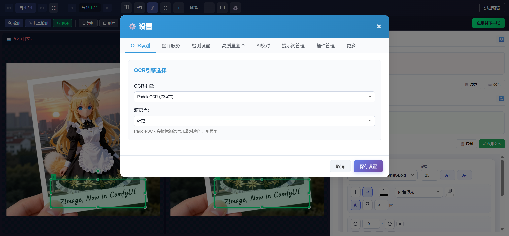

### 个人二开定制化
+ 新增编辑模式打开设置的按钮

    

    
----


<p align="center">
    
</p>

<h1 align="center">Saber-Translator</h1>

<p align="center">
    ✨ 你的专属 AI 漫画翻译与管理神器，集翻译、编辑、书架管理、智能分析于一体！✨
</p>

<p align="center">
    <a href="https://github.com/MashiroSaber03/Saber-Translator/stargazers">
        
    </a>
    <a href="LICENSE">
        
    </a>
</p>

<div align="center">
    <a href="https://github.com/MashiroSaber03/Saber-Translator/issues">问题反馈 / 建议</a>
    |
    <a href="http://www.mashirosaber.top" target="_blank">使用教程</a>
</div>
**求职广告：本人是26届应届本科生，走过路过的老板们给个工作机会好不好😭😭😭😭😭😭😭😭**

---

## ✨ 主要功能

Saber-Translator 提供了一站式的漫画翻译与管理解决方案，集成了从内容导入、翻译编辑、书架管理到智能分析的完整工作流。

### 🔄 核心翻译流程

```
📥 导入图片/PDF → 🔍 文本检测 → 📝 OCR识别 → 🌐 AI翻译 → 🎨 图像修复 → ✏️ 文字渲染 → 📤 导出
```

<table>
<tr>
<th>模块</th>
<th>功能</th>
<th>支持选项</th>
</tr>
<tr>
<td><b>📥 文件导入</b></td>
<td>支持多种格式上传</td>
<td>JPG, PNG, WEBP, PDF (自动提取图像)</td>
</tr>
<tr>
<td><b>🔍 文本检测</b></td>
<td>自动识别漫画气泡/文本区域</td>
<td>CTD (默认, 精确掩膜) + 手动标注模式</td>
</tr>
<tr>
<td><b>📝 OCR 识别</b></td>
<td>多引擎多语言文字识别</td>
<td>MangaOCR (日语) / PaddleOCR (多语言) / 百度OCR / AI视觉OCR</td>
</tr>
<tr>
<td><b>🌐 AI 翻译</b></td>
<td>多服务商翻译引擎</td>
<td>SiliconFlow / DeepSeek / Gemini / 火山引擎 / Ollama / Sakura 等</td>
</tr>
<tr>
<td><b>🎨 图像修复</b></td>
<td>消除原文文字</td>
<td>LAMA智能修复 / 纯色填充</td>
</tr>
<tr>
<td><b>✏️ 文字渲染</b></td>
<td>将译文嵌入图片</td>
<td>自定义字体/字号/颜色/描边/方向/位置</td>
</tr>
<tr>
<td><b>📤 导出下载</b></td>
<td>多格式导出</td>
<td>PNG / ZIP / PDF / CBZ</td>
</tr>
</table>

> 💡 **高质量翻译模式 (Beta)**: 使用多模态模型进行多图上下文感知翻译，通过结合多张图片信息提升翻译连贯性和准确性。

### 🛠️ 编辑与管理功能

| 功能 | 说明 |
|------|------|
| **编辑模式** | 翻译后精细调整：修改文本/字体/颜色/位置，内置标注功能可手动绘制/调整文本框 |
| **会话管理** | 保存/加载完整工作进度 |
| **文本导入导出** | JSON格式导入导出，便于协作校对 |

### 📚 书架系统

<table>
<tr>
<td width="33%" align="center"><b>📖 书籍管理</b><br/>创建/编辑/搜索/批量操作</td>
<td width="33%" align="center"><b>📑 章节管理</b><br/>创建/排序/自动统计</td>
<td width="33%" align="center"><b>🏷️ 标签系统</b><br/>分类/筛选/自定义颜色</td>
</tr>
</table>

### 📖 漫画阅读器

专属阅读界面：翻页阅读 | 原图/译图切换 | 章节导航 | 自适应显示

### 🧠 Manga Insight 智能分析

> 🔮 基于 AI 的漫画内容深度理解引擎

| 功能 | 说明 |
|------|------|
| **内容分析** | 角色识别、剧情梳理、对话提取 |
| **任务管理** | 全书/增量/章节分析，支持暂停恢复 |
| **智能问答** | 基于分析结果对漫画具体情节进行智能问答 |
| **向量检索** | 语义搜索快速定位内容 |

## ✨ Demo (效果示例)

<div align='center'>
    
    <p>_✨ Saber-Translator 翻译界面概览 ✨_</p>
</div>
<div align='center'>
    
    <p>_📚 Saber-Translator 书架管理界面概览 📚_</p>
</div>

<div align='center'>
    
    <p>_🔍 Saber-Translator 漫画分析界面概览 🔍_</p>
</div>

**翻译效果对比：**

<div align='center'>
    <table style="width: 80%; border-collapse: collapse;">
        <tr>
            <th style="width: 50%; border: 1px solid #ddd; padding: 8px; text-align: center;">翻译前</th>
            <th style="width: 50%; border: 1px solid #ddd; padding: 8px; text-align: center;">翻译后</th>
        </tr>
        <tr>
            <td style="border: 1px solid #ddd; padding: 8px; text-align: center;">
                
            </td>
            <td style="border: 1px solid #ddd; padding: 8px; text-align: center;">
                
            </td>
        </tr>
        <tr>
            <td style="border: 1px solid #ddd; padding: 8px; text-align: center;">
                
            </td>
            <td style="border: 1px solid #ddd; padding: 8px; text-align: center;">
                
            </td>
        </tr>
    </table>
</div>
<br/>

## ✨ 使用方式

### 快速上手

1.  **下载最新版本**: 前往 [Releases](https://github.com/MashiroSaber03/Saber-Translator/releases) 页面，或加入 QQ 群下载对应你操作系统的最新版本压缩包。
    - 1群: 1041505784
    - 2群: 1047553423
    - 3群: 536706173
    - 4群: 1074032394
2.  **解压**: 将下载的压缩包解压到你希望存放程序的目录。
3.  **运行程序**: 在解压后的目录中，找到 `Saber-Translator.exe` (Windows) 或对应名称的可执行文件，双击运行。
4.  **开始翻译**: 程序启动后，通常会自动在你的默认浏览器中打开 Saber-Translator 的 Web 界面 (默认地址为 `http://127.0.0.1:5000/`)。如果未自动打开，请手动访问该地址。
5.  **上传与配置**: 通过拖拽或点击选择按钮上传你的漫画图片或 PDF 文件。并参考 [使用教程](http://www.mashirosaber.top) 完成翻译服务商配置。
6.  **翻译**: 点击“翻译当前图片”或“翻译所有图片”按钮开始处理。
7.  **查看与下载**: 在主界面查看翻译结果，使用右侧缩略图切换图片，调整显示大小，并通过下载按钮获取翻译后的文件。
8.  **详细教程**: 参考 [使用教程](http://www.mashirosaber.top) 获取更详细的步骤和技巧。

### 编辑模式

<div align='center'>
    
    <p>_✨ Saber-Translator 编辑模式示例 ✨_</p>
</div>

翻译完成后，点击图片上方的“**切换编辑模式**”按钮进入编辑模式，可进行以下操作：

**气泡编辑**：
*   选择气泡后可修改文本、字体、字号、颜色、填充色、排版方向、旋转角度、位置偏移
*   所有更改实时预览，支持一键应用样式到全部气泡

**标注功能**：

*   绘制/移动/调整/删除文本框，解决自动检测不准确的问题
*   支持自动检测辅助、批量检测所有图片
*   可使用手动标注框进行翻译

### 高质量翻译模式

位于左侧设置栏的 "高质量翻译模式 " 板块提供了一个实验性的多步骤翻译流程。该模式旨在通过多模态模型结合多张图片的上下文信息来提升翻译的连贯性和准确性。

*   **配置**: 用户可以设置AI服务商、API Key、模型、批处理大小（一次发送给AI的图片数量）、会话重置频率（多少批次后清空AI的短期记忆）、RPM限制、是否使用低推理模式（部分模型支持以降低思考深度换取速度）、是否强制AI返回JSON格式以及自定义的上下文翻译提示词。
*   **流程**:
    1.  程序会先对所有已上传的图片进行文字区域的消除和原文提取。
    2.  然后将所有图片的原文组织成JSON格式。
    3.  同时收集所有原始图片的Base64数据。
    4.  接着，它会根据用户设置的“每批次图片数”，分批将图片和对应的JSON文本片段发送给AI进行上下文感知的翻译。
    5.  AI返回的翻译结果会被合并。
    6.  最后，程序将合并后的翻译结果导入到对应的图片和气泡中，并重新渲染。
*   **适用场景**: 当漫画对话连贯性要求较高，且单个气泡的独立翻译效果不佳时，可以尝试此模式。
*   **注意**: 此模式会消耗更多的处理时间和API配额，因为它需要对所有图片进行多次处理和AI调用。请确保你的API Key有足够的额度，并根据服务商的限制合理配置RPM。

### 书架系统


书架系统提供了完整的漫画管理功能，让你的翻译项目井井有条：

*   **访问书架**: 点击导航栏的"书架"按钮进入书架管理界面.
*   **创建书籍**: 点击"新建书籍"，输入书名，可选择上传封面图片和添加标签.
*   **管理章节**: 进入书籍后，可以创建、编辑、删除和排序章节.
*   **翻译章节**: 点击章节进入翻译工作区，翻译进度会自动保存到该章节.
*   **阅读模式**: 完成翻译后，可以进入阅读器查看翻译成果.
*   **标签管理**: 在书架页面可以创建和管理标签，为书籍分类整理.

### Manga Insight 智能分析

Manga Insight 是一个基于 AI 的漫画内容深度理解引擎，它能够分析漫画原图、提取剧情信息、构建知识库，并支持基于分析结果的智能问答。


#### 1. 分析任务管理

*   **多种分析模式**:
    *   **全书分析**: 从头到尾分析整本漫画，适合首次分析。
    *   **增量分析**: 仅分析新增的章节/页面，适合连载漫画的更新。
    *   **章节分析**: 分析指定章节，适合部分内容重新分析。
    *   **批量页面分析**: 分析指定的多个页面，适合精细化调整。
*   **任务控制**: 分析过程中支持**暂停**、**恢复**、**取消**操作，任务进度实时可见。
*   **任务历史**: 查看历史分析任务的状态和结果。

#### 2. 四层级分析架构

采用层级式分析架构，从页面级逐步汇总到全书级，确保分析的完整性和连贯性：

```
📄 批量分析 (每5页) → 📑 段落总结 → 📖 章节总结 → 📚 全书概述
```

*   **架构预设**:
    *   **简洁模式**: 批量分析 → 全书总结（适合100页以内的短篇）
    *   **标准模式**: 批量分析 → 段落总结 → 全书总结（通用）
    *   **章节模式**: 批量分析 → 章节总结 → 全书总结（有明确章节的漫画）
    *   **完整模式**: 批量分析 → 小总结 → 章节总结 → 全书总结（长篇连载）
*   **上下文关联**: 批量分析时自动引用前N批的分析结果作为上下文，保持剧情理解的连贯性。

#### 3. 智能问答 (RAG)


基于检索增强生成 (RAG) 技术，支持对漫画内容进行智能问答：

*   **两种问答模式**:
    *   **精确模式**: 使用向量检索定位相关页面，适合具体问题（如"第15页发生了什么"）
    *   **全局模式**: 使用全书摘要作为上下文，适合总结性问题（如"故事的主题是什么"）
*   **混合检索**: 结合向量相似度（70%）和关键词匹配（30%）的双路检索策略。
*   **Reranker 重排序**: 支持 Jina、Cohere、SiliconFlow、BGE 等重排序模型，提升检索精度。
*   **推理检索**: 自动将复杂问题分解为多个子问题并行检索，整合结果后回答。
*   **父子块检索**: 返回匹配内容所属批次的完整上下文，便于理解前后剧情。
*   **引用定位**: 回答时自动标注引用的页码，支持点击跳转到对应页面。

#### 4. 多模板概述生成


支持多种风格的概述生成，满足不同场景需求：

| 模板 | 说明 |
|------|------|
| 📖 故事概要 | 完整的剧情回顾，包含所有剧透 |
| 🎁 无剧透简介 | 不含关键剧透的故事简介，适合推荐给朋友 |
| ⏪ 前情回顾 | 精炼版剧情回顾，适合接续阅读前快速回忆 |
| 👥 角色图鉴 | 详细的人物介绍和关系梳理 |
| 🌍 世界观设定 | 故事的世界观、势力、规则等背景设定 |
| ✨ 名场面盘点 | 精彩场景和高光时刻回顾，附页码定位 |
| 📝 阅读笔记 | 结构化的阅读笔记，包含要点和思考 |

#### 5. 剧情时间线


*   **增强模式**: 使用 LLM 智能整合事件，生成结构化的剧情弧和角色行动线。
*   **简单模式**: 直接提取关键事件列表，按页面顺序排列。
*   **可视化展示**: 时间线数据可在界面中直观查看。

#### 6. 向量检索系统

*   **双层索引**: 页面级向量（page_summary）+ 事件级向量（key_events）
*   **语义搜索**: 输入关键词或描述，快速定位相关内容。
*   **重建向量**: 支持在更换 Embedding 模型后重新构建向量索引。

## 🚀 路线图 (未来计划)

我们计划在未来的版本中加入更多令人兴奋的功能：

*   **更多 AI 服务支持**: 集成更多云端翻译和OCR服务。
*   **更多目标语言**: 增加对更多目标语言的翻译支持。
*   **术语库/词典**: 允许用户导入自定义术语库，保证特定词汇翻译的一致性。
*   **性能优化**: 持续优化图像处理、模型推理速度和前端交互的流畅性。
*   **UI/UX 改进**: 进一步提升用户界面的易用性和美观度，例如提供更直观的字体预览、颜色选择器等。
*   **国际化 (i18n)**: 支持界面语言切换。
*   **更完善的错误恢复机制**: 例如，在批量处理失败时，允许用户重试失败的部分。
*   **Docker 支持**: 提供 Docker 镜像，简化部署和环境配置。
*   **Manga Insight 增强**: 进一步完善智能分析功能，增加更多角色识别和剧情分析能力。

## 💖 赞助 (Sponsorship)

感谢你对 Saber-Translator 项目的关注和支持！ 如果你觉得本项目对你有所帮助，并且愿意支持我继续开发和维护，可以通过以下方式进行赞助。 你的支持是我前进的最大动力！

**赞助方式：**

你可以通过微信或支付宝扫描下方二维码进行赞赏。 你的每一份支持都将用于功能开发和持续优化。

<div align="center">
    <table>
        <tr>
            <td style="text-align: center; padding: 0 20px;">
                
                <p>微信赞赏码</p>
            </td>
            <td style="text-align: center; padding: 0 20px;">
                
                <p>支付宝赞赏码</p>
            </td>
        </tr>
    </table>
</div>

<p align="center">
    再次感谢你的慷慨支持！
</p>

## ❤️ 贡献

欢迎任何形式的贡献，包括但不限于：

*   **代码贡献 (Pull Requests)**: 修复 Bug, 增加新功能, 优化代码性能, 开发新插件等。
*   **问题反馈 (Issues)**: 报告 Bug, 提出功能建议, 分享使用遇到的问题等。
*   **文档完善**: 改进 README 文档, 编写更详细的使用教程或开发文档。
*   **翻译贡献**: 将 README 文档或界面翻译成其他语言。
*   **推广宣传**: 向更多人介绍和推荐 Saber-Translator。

## 🌟 支持

*   **Star 项目**: 如果你觉得 Saber-Translator 对你有帮助，请给项目点个 Star ⭐，这将是对我最大的鼓励和支持！
*   **分享推荐**: 将 Saber-Translator 分享给你的朋友或有需要的人。

## 🛠️ 技术栈 (Tech Stack)

*   **后端:** Python 3.10+, Flask, Flask-CORS, PyTorch, PaddlePaddle-OCR, MangaOCR, Pillow, OpenCV, NumPy, `openai` (SDK), `litelama` / `lama-mpe`, PyPDF2, Requests, PyYAML, Colorama.
*   **前端:** **Vue 3**, **Vite**, **TypeScript**, **Pinia**, Axios, Canvas API, JSZip, jsPDF.
*   **文本检测:** CTD (Comic Text Detector), YOLOv5.
*   **图像修复:** LAMA-MPE, LiteLAMA.
*   **向量检索:** Embedding, Reranker (用于 Manga Insight).
*   **打包:** PyInstaller.

## ⚠️ 免责声明 (Disclaimer)

1.  Saber-Translator 主要用于学习和技术交流，请在遵守当地法律法规和版权政策的前提下使用。**严禁用于非法目的或商业用途。**
2.  本项目依赖第三方 AI 服务 (如 OCR, 翻译 API, 背景修复模型)，其服务质量、可用性和成本由相应服务商决定。请用户自行了解并遵守相关服务商的使用协议和条款。
3.  翻译结果由 AI 模型生成，可能存在错误或不准确之处。本项目不对翻译结果的准确性、完整性或及时性做任何保证。
4.  用户应对使用本工具处理的任何内容负责，包括确保拥有处理这些内容的合法权利。
5.  对于因使用或无法使用本项目而造成的任何直接或间接损失，项目作者不承担任何责任。

---

<p align="center">
    感谢使用 Saber-Translator！希望它能帮助你更轻松地跨越语言障碍，享受漫画的乐趣！
</p>
